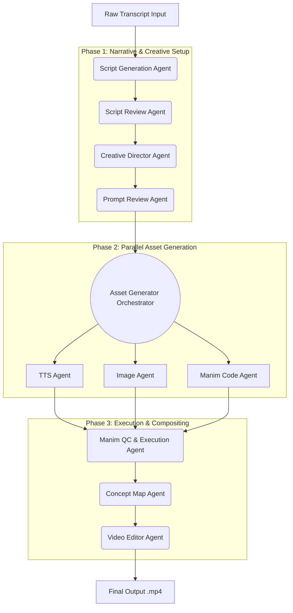

# EduReel Video Generation Pipeline
**System Architecture & Agent Flow**

This document outlines the architecture of the EduReel system, a fully autonomous multi-agent pipeline powered by Google's Agentic Development Kit (ADK) and Gemini 2.x. The system ingests raw educational transcripts and orchestrates multiple AI sub-agents to deliver a polished, cinematic, short-form educational video.

## 1. High-Level Pipeline Architecture

The EduReel architecture operates on a `SequentialAgent` structure representing the main video rendering timeline, containing a nested `ParallelAgent` for executing heavy, asynchronous asset generation.



---

## 2. Detailed Agent Roles & Data Flow

### 2.1 Script Generation Agent
**Role:** Ingests the raw transcript and designs the video pacing.
* Generates a 3–8 segment JSON storyboard.
* Categorizes each segment into either `"general"` (explainer/aesthetic) or `"manim"` (scientific/mathematical content).
* Is fully responsible for producing the critical 6-second **curiosity hook** at segment 1 to maximize viewer retention.

### 2.2 Script Review Agent
**Role:** The rigorous JSON validator.
* Reviews the generator's output for JSON schema compliance.
* Validates LaTeX expressions formatting (`math_expressions`).
* Fails-fast and initiates an auto-healing prompt if structural errors exist.

### 2.3 Creative Director Agent
**Role:** The visual architect.
* **Cinematic Prompts:** Enhances all `"general"` segments into hyper-detailed, 8K, documentary-style Imagen 3.0 prompts (e.g., National Geographic/BBC styling).
* **Text Overlays:** Autonomously decides when a core concept is introduced and injects short text overlays with highlighted vocabulary.
* **Manim Backgrounds:** Decides if a scientific calculation should occur in a literal dark void vs. overlaid onto a generated real-world image (e.g., Photosynthesis equation over a hyper-realistic forest).

### 2.4 Prompt Review Agent
**Role:** The safety and compliance bouncer.
* Scans all generated image prompts to prevent Imagen safety-policy rejections.
* Ensures Manim animation specifications are explicitly scoped and achievable.

### 2.5 Asset Generator (Parallel Graph)
Because network I/O to audio, image models, and LLMs operate independently, they run under a `ParallelAgent` graph using `ThreadPoolExecutors` per-segment.
* **TTS Agent:** Streams segment dialog to Google Cloud Text-To-Speech (Neural2 voices), falling back to gTTS if cloud access is unavailable.
* **Image Agent:** Pings Imagen 3.0 via the Vertex/GenAI SDK to render all standard slides and Manim background plates in parallel.
* **Manim Code Agent:** Interrogates Gemini Code models to compile complex Python `Manim CE` scripts capable of animating the segmented latex formulas.

### 2.6 Manim QC (Quality Control) Agent
**Role:** Subprocess Execution & Auto-Healing.
* Executes the generated Manim `.py` scripts locally using `manim render -t --format mov`.
* Analyzes `stderr` output if a render fails.
* **Auto-Healing Loop:** Automatically patches the code with Gemini 2.x and retries rendering up to 3 times per segment.
* Triggers a safe "static fallback" animation if the animation loop absolutely cannot resolve.

### 2.7 Concept Map Agent
**Role:** The UX Tracker.
* Renders a glassmorphic, transparent HUD using `Pillow (PIL)`.
* Places a dynamic tracking map overlay in the corner of the Reel to visualize user progress through the educational topics.

### 2.8 Video Editor Agent
**Role:** The `MoviePy` Master Compositor.
1. Syncs the rendered Manim `.mov` Alpha videos natively over the cinematic Image plates.
2. Draws `text_overaly` definitions as floating text blocks with dynamic yellow high-lighting.
3. Glues the Concept Map UI to the upper quadrant.
4. Performs `ffmpeg` concatenation with smooth 0.3s audio/video crossfades between all segments, delivering a cohesive vertical video.

---

## 3. Data Schema Example

Below is the standard payload passed between agents inside `enhanced_script`:

```json
{
  "segment_id": 2,
  "segment_type": "manim",
  "narration": "Let's take a look at the Pythagorean theorem.",
  "duration_seconds": 8.0,
  "math_expressions": ["a^2 + b^2 = c^2"],
  "background_image": true,
  "text_overlay": {
    "lines": ["Pythagorean Theorem"],
    "highlight_words": ["Pythagorean"]
  },
  "image_prompt": "Cinematic real-world shot of an ancient Greek mosaic..."
}
```

## 4. Notable Optimizations
* **Hook Agent Consolidation**: Replaced isolated NLP hook micro-services with centralized pre-prompting, saving 2 full LLM context lookups.
* **Native Compositing**: Eliminated opaque black boxes in Manim processing by configuring a specialized alpha-channel ProRes `.mov` output.
* **Parallel Fan-out**: Network requests scale horizontally across all clips simultaneously, dramatically cutting video payload build time.
