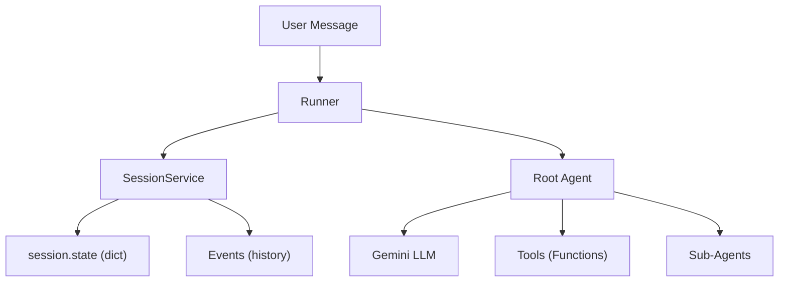
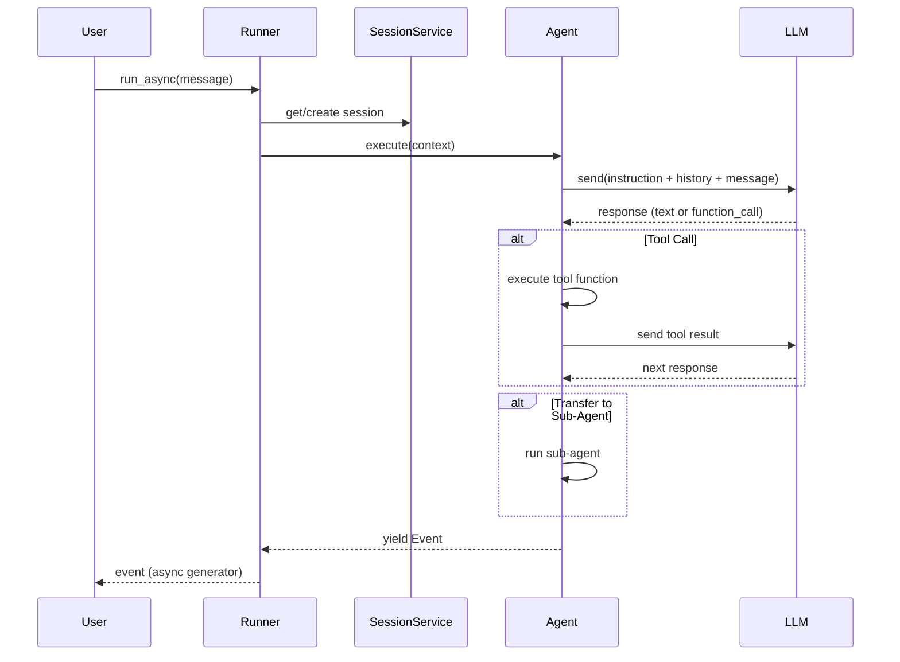
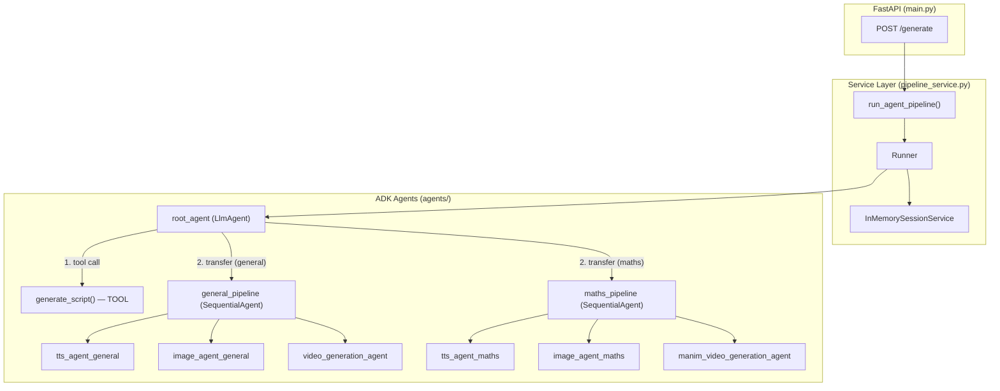

# Google ADK — Complete Guide

> Official docs: [google.github.io/adk-docs](https://google.github.io/adk-docs)

---

## 1. What is Google ADK?

**Agent Development Kit (ADK)** is a Python framework by Google for building multi-agent AI systems powered by Gemini LLMs. It provides:

- **Agent abstractions** — LLM-powered agents and deterministic workflow agents
- **Session & State management** — track conversations and share data between agents
- **Runner** — the execution engine that drives the event loop
- **Built-in tools** — function calling, agent delegation, code execution

---

## 2. Core Architecture



**Key principle:** The Runner orchestrates everything. It takes a user message, creates/retrieves a Session, runs the agent, and yields Events.

---

## 3. Agent Types

### 3.1 LLM Agent ([Agent](file:///d:/2026/POCs/EduReelADK/models/api_models.py#17-22) / `LlmAgent`)

The core building block. An LLM-powered agent that can reason, call tools, and delegate to sub-agents.

```python
from google.adk.agents import Agent

my_agent = Agent(
    name="my_agent",              # Required: unique identifier
    model="gemini-2.0-flash",     # Required: which LLM to use
    description="...",            # Used by parent agents for routing
    instruction="...",            # System prompt — tells the LLM what to do
    tools=[my_function],          # List of callable tools
    sub_agents=[child_agent],     # Child agents it can delegate to
    output_key="result",          # Auto-save response to session.state["result"]
)
```

| Parameter | Required | Purpose |
|-----------|----------|---------|
| `name` | ✅ | Unique ID. Used for `transfer_to_agent`. Avoid `"user"` |
| `model` | ✅ | LLM model string (e.g., `"gemini-2.0-flash"`, `"gemini-3-flash-preview"`) |
| `description` | Recommended | Used by parent LLM agents to decide when to delegate here |
| `instruction` | ✅ | System prompt guiding the agent's behavior |
| `tools` | Optional | Python functions the agent can call |
| `sub_agents` | Optional | Child agents for delegation |
| `output_key` | Optional | Auto-saves agent's text response into `session.state[output_key]` |
| `output_schema` | Optional | Forces structured JSON output (Pydantic model) |
| `input_schema` | Optional | Expects structured JSON input |

### 3.2 SequentialAgent (Workflow Agent)

Runs sub-agents **in order**, one after another. No LLM involved — purely deterministic.

```python
from google.adk.agents import SequentialAgent

pipeline = SequentialAgent(
    name="my_pipeline",
    description="Runs A → B → C in order",
    sub_agents=[agent_a, agent_b, agent_c],  # Executed in this order
)
```

**How data flows:** Each sub-agent shares the **same `InvocationContext`** (same session state). Agent A writes to `session.state["step_a_output"]` via `output_key`, Agent B reads it from conversation context.

**No `model` needed** — `SequentialAgent` doesn't use an LLM. It just executes sub-agents sequentially.

### 3.3 Other Workflow Agents

| Agent | Purpose |
|-------|---------|
| `ParallelAgent` | Runs sub-agents **concurrently** |
| `LoopAgent` | Runs sub-agents in a **loop** until a condition is met |
| `CustomAgent` | Extend `BaseAgent` for fully custom logic |

---

## 4. Tools (Function Calling)

Tools give agents capabilities beyond the LLM. In Python, any function can be a tool:

```python
def get_weather(city: str) -> dict:
    """Gets the current weather for a city."""  # ← docstring becomes tool description
    return {"city": city, "temp": "22°C", "condition": "Sunny"}

agent = Agent(
    name="weather_agent",
    model="gemini-2.0-flash",
    instruction="Use the get_weather tool when asked about weather.",
    tools=[get_weather],  # Pass function directly — ADK wraps it as FunctionTool
)
```

**How it works:**
1. The LLM sees the function name, docstring, and parameter types
2. It decides to call the function with arguments
3. ADK executes the function and returns the result to the LLM
4. The LLM formulates a response based on the tool result

> [!IMPORTANT]
> **Tool calls don't end the conversation.** The LLM gets the result back and continues reasoning. This is different from `transfer_to_agent` which hands off control.

---

## 5. Multi-Agent Delegation

### 5.1 `transfer_to_agent` (LLM-Driven)

When an `LlmAgent` has `sub_agents`, ADK auto-generates a `transfer_to_agent` tool. The LLM decides when to delegate:

```python
root = Agent(
    name="root",
    model="gemini-2.0-flash",
    instruction="Transfer to billing_agent for billing questions.",
    sub_agents=[billing_agent, support_agent],
    # ADK auto-adds: transfer_to_agent(agent_name="billing_agent")
)
```

### 5.2 Single-Parent Rule

> [!CAUTION]
> **Each agent instance can only belong to ONE parent.** You cannot reuse the same agent instance in two different `SequentialAgent` pipelines.

```python
# ❌ WRONG — same instance in two parents
tts = Agent(name="tts", ...)
pipeline_a = SequentialAgent(sub_agents=[tts, ...])
pipeline_b = SequentialAgent(sub_agents=[tts, ...])  # ERROR!

# ✅ CORRECT — separate instances
tts_a = Agent(name="tts_general", ...)
tts_b = Agent(name="tts_maths", ...)
pipeline_a = SequentialAgent(sub_agents=[tts_a, ...])
pipeline_b = SequentialAgent(sub_agents=[tts_b, ...])
```

### 5.3 Tool vs Transfer — Key Difference

| Mechanism | What happens | Control returns? | Use when |
|-----------|-------------|-------------------|----------|
| **Tool call** | Agent calls a function, gets result | ✅ Yes — agent keeps control | Need result and want to continue |
| **`transfer_to_agent`** | Hands off to sub-agent entirely | ⚠️ Sub-agent becomes active | Done with current agent's work |

> [!WARNING]
> **Gotcha we hit:** If root transfers to Agent A, and A produces a final response, the Runner marks the interaction as complete. Root never gets control back to transfer to Agent B. **Solution:** Make Agent A's work a tool call on root instead.

---

## 6. Session, State & Events

### 6.1 Session

A **Session** represents one conversation thread between a user and your agent system.

```python
session = await session_service.create_session(
    app_name="MyApp",
    user_id="user_123",
    session_id="session_456",  # Optional — auto-generated if not provided
)
```

Each session contains:
- **`session.events`** — chronological list of all messages and actions
- **`session.state`** — key-value dictionary for temporary data

### 6.2 State (`session.state`)

A **dictionary** that agents use to pass data to each other:

```python
# An agent's output_key auto-saves to state:
agent = Agent(..., output_key="script_output")
# After running: session.state["script_output"] = "agent's text response"

# In tools, you can also modify state via tool context:
def my_tool(ctx: ToolContext, data: str) -> dict:
    ctx.state["my_key"] = "my_value"
    return {"status": "ok"}
```

**State prefixes (scoping):**

| Prefix | Scope | Example |
|--------|-------|---------|
| (none) | Session-level, shared across all agents | `"script_output"` |
| `app:` | App-level, shared across all sessions for a user | `"app:user_prefs"` |
| `user:` | User-level, shared across all apps | `"user:language"` |
| `temp:` | Temporary, exists only during current invocation | `"temp:step_counter"` |

### 6.3 Events

Every action in ADK produces an **Event**. Events are what `runner.run_async()` yields:

```python
async for event in runner.run_async(user_id=..., session_id=..., new_message=...):
    event.author        # Which agent produced this: "root_agent", "tts_agent", etc.
    event.content       # The Content object with Parts (text, function_call, etc.)
    event.is_final_response()  # True if this is the terminal response
```

**Event content types:**
- `part.text` — text output from the agent
- `part.function_call` — agent requesting a tool call
- `part.function_response` — result of a tool call

---

## 7. SessionService

Manages the lifecycle of Sessions (create, retrieve, update, delete).

### 7.1 InMemorySessionService

```python
from google.adk.sessions import InMemorySessionService

session_service = InMemorySessionService()
```

| Aspect | Detail |
|--------|--------|
| **Storage** | In-memory (Python dict) |
| **Persistence** | ❌ None — data lost on restart |
| **Setup** | Zero config |
| **Best for** | Local dev, testing, prototyping |

### 7.2 Other Implementations

| Service | Persistence | Use Case |
|---------|-------------|----------|
| `InMemorySessionService` | None | Local dev |
| `DatabaseSessionService` | SQLite/PostgreSQL | Production with DB |
| `VertexAiSessionService` | Google Cloud | Cloud deployment on Vertex AI |

---

## 8. Runner

The **Runner** is the execution engine. It connects your agent to a session service and drives the event loop.

```python
from google.adk.runners import Runner

runner = Runner(
    agent=root_agent,               # The root agent to execute
    app_name="MyApp",               # Application identifier
    session_service=session_service, # Where to store sessions
)
```

### 8.1 `runner.run_async()` — The Event Loop

This is the core method. It:
1. Retrieves/creates a Session
2. Sends the user message to the agent
3. The agent reasons, calls tools, delegates to sub-agents
4. Each step yields an **Event**
5. Loop continues until the agent produces a final response

```python
from google.genai import types

user_message = types.Content(
    role="user",
    parts=[types.Part(text="Tell me about photosynthesis")],
)

async for event in runner.run_async(
    user_id="user_123",
    session_id="session_456",
    new_message=user_message,
):
    if event.is_final_response():
        print(event.content.parts[0].text)
```

### 8.2 What happens inside `run_async()`



---

## 9. [run_agent_pipeline()](file:///d:/2026/POCs/EduReelADK/services/pipeline_service.py#19-74) — Our Custom Helper

This is **not** an ADK built-in — it's the custom function we wrote in [pipeline_service.py](file:///d:/2026/POCs/EduReelADK/services/pipeline_service.py) to bridge FastAPI with ADK:

```python
async def run_agent_pipeline(user_id, session_id, transcript):
    # 1. Create a fresh session for this request
    session = await session_service.create_session(
        app_name=APP_NAME, user_id=user_id, session_id=session_id
    )
    
    # 2. Wrap the transcript as an ADK Content message
    user_message = types.Content(
        role="user",
        parts=[types.Part(text=transcript)]
    )
    
    # 3. Run the agent and iterate over ALL events
    async for event in runner.run_async(
        user_id=user_id,
        session_id=session_id,
        new_message=user_message,
    ):
        # Log every event (tool calls, agent transfers, responses)
        # Capture the final response when is_final_response() is True
    
    return final_response, logs
```

**Why we built this:**
- ADK's `Runner` is generic — it yields raw events
- We needed logging, error handling, and response collection for our FastAPI endpoint
- This function bridges the gap between ADK's async event loop and our REST API

---

## 10. How It All Connects (EduReel Example)



**Flow for a request:**
1. `POST /generate` → calls [run_agent_pipeline()](file:///d:/2026/POCs/EduReelADK/services/pipeline_service.py#19-74)
2. Creates session via `InMemorySessionService`
3. `Runner.run_async()` sends transcript to `root_agent`
4. `root_agent` calls `generate_script` **tool** → gets script with `content_type`
5. `root_agent` reads `content_type`, uses `transfer_to_agent` to hand off to correct pipeline
6. `SequentialAgent` runs TTS → Image → Video agents **in order**
7. Each agent writes output to `session.state` via `output_key`
8. Final agent's response becomes the pipeline output

---

## 11. Key Gotchas & Best Practices

| Gotcha | Solution |
|--------|----------|
| Agent instance in two parents → error | Create separate instances per pipeline |
| `transfer_to_agent` ends the conversation | Use tool calls for intermediate steps, transfer only for the final handoff |
| Free-tier quota exhausted for a model | Switch to a different model (`gemini-2.0-flash-lite`, `gemini-3-flash-preview`) |
| `InMemorySessionService` loses data on restart | Use `DatabaseSessionService` for production |
| Agent ignores `output_key` | Make sure instruction says "Return ONLY the raw output" — LLM commentary pollutes state |
| Agent doesn't call the right tool | Improve tool docstrings — the LLM uses them to decide |

---

## 12. Quick Reference: All Imports

```python
# Agents
from google.adk.agents import Agent, SequentialAgent, ParallelAgent, LoopAgent

# Runner
from google.adk.runners import Runner

# Sessions
from google.adk.sessions import InMemorySessionService
from google.adk.sessions import DatabaseSessionService      # For production
from google.adk.sessions import VertexAiSessionService      # For Google Cloud

# Message types (for building user messages)
from google.genai import types
# types.Content, types.Part
```
