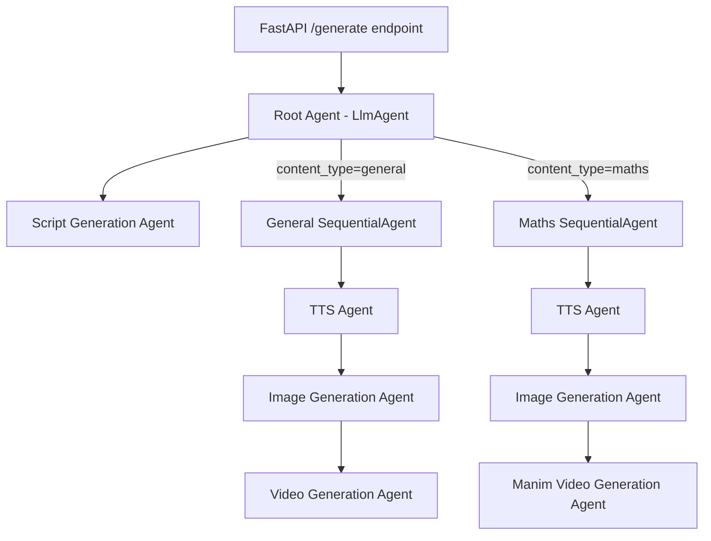

# EduReel ADK Server — FastAPI + Google ADK Multi-Agent Pipeline

Build a FastAPI server that uses Google ADK to orchestrate education reel video generation via a multi-agent pipeline. A root agent dynamically routes to one of two `SequentialAgent` pipelines based on the `content_type` (`general` vs `maths`) produced by the script generation agent.

## Architecture

**How it works:**
1. User sends transcript text to `/generate` POST endpoint
2. Root agent (LlmAgent) receives the transcript, delegates to `script_generation_agent` as first sub-agent
3. Script agent generates a structured script with `content_type` field (`general` or `maths`) and stores result in shared state via `output_key`
4. Root agent reads `content_type` from state and delegates to either the **general pipeline** or **maths pipeline** (both are `SequentialAgent`)
5. Each pipeline runs TTS → Image Generation → Video/Manim sequentially, passing results via shared state

## Proposed Changes

### Project Scaffolding

#### [NEW] [requirements.txt](file:///d:/2026/POCs/EduReelADK/requirements.txt)
- `google-adk`, `fastapi`, `uvicorn[standard]`, `pydantic`, `python-dotenv`

#### [NEW] [.env.example](file:///d:/2026/POCs/EduReelADK/.env.example)
- `GOOGLE_API_KEY=your_api_key_here`

---

### ADK Agent Package (`edu_reel_agent/`)

#### [NEW] [\_\_init\_\_.py](file:///d:/2026/POCs/EduReelADK/edu_reel_agent/__init__.py)
- Exports `root_agent` from the agent module

#### [NEW] [schemas.py](file:///d:/2026/POCs/EduReelADK/edu_reel_agent/schemas.py)
- Pydantic models for inter-agent data: `ScriptSegment`, `ScriptOutput`, `TTSOutput`, `ImageOutput`, `VideoOutput`
- Each schema has proper fields (e.g., `ScriptOutput` has `title`, `segments[]`, `content_type`)

#### [NEW] [script_generation_agent.py](file:///d:/2026/POCs/EduReelADK/edu_reel_agent/script_generation_agent.py)
- `generate_script(transcript: str) -> dict` tool function returning dummy structured script with `content_type`
- `script_generation_agent` = `Agent(name="script_generation_agent", tools=[generate_script], output_key="script_output")`

#### [NEW] [tts_agent.py](file:///d:/2026/POCs/EduReelADK/edu_reel_agent/tts_agent.py)
- `generate_tts(script_json: str) -> dict` tool returning dummy audio file paths
- `tts_agent` = `Agent(name="tts_agent", tools=[generate_tts], output_key="tts_output")`

#### [NEW] [image_generation_agent.py](file:///d:/2026/POCs/EduReelADK/edu_reel_agent/image_generation_agent.py)
- `generate_images(script_json: str) -> dict` tool returning dummy image file paths
- `image_generation_agent` = `Agent(name="image_generation_agent", tools=[generate_images], output_key="image_output")`

#### [NEW] [video_generation_agent.py](file:///d:/2026/POCs/EduReelADK/edu_reel_agent/video_generation_agent.py)
- `compose_video(tts_json: str, images_json: str) -> dict` tool returning dummy video path
- `video_generation_agent` = `Agent(name="video_generation_agent", tools=[compose_video], output_key="video_output")`

#### [NEW] [manim_video_generation_agent.py](file:///d:/2026/POCs/EduReelADK/edu_reel_agent/manim_video_generation_agent.py)
- `compose_manim_video(script_json: str, tts_json: str, images_json: str) -> dict` tool returning dummy Manim video path
- `manim_video_generation_agent` = `Agent(name="manim_video_generation_agent", tools=[compose_manim_video], output_key="video_output")`

#### [NEW] [agent.py](file:///d:/2026/POCs/EduReelADK/edu_reel_agent/agent.py)
- Imports all sub-agents
- Creates two `SequentialAgent` pipelines:
  - `general_pipeline` = `SequentialAgent(sub_agents=[tts_agent, image_generation_agent, video_generation_agent])`
  - `maths_pipeline` = `SequentialAgent(sub_agents=[tts_agent, image_generation_agent, manim_video_generation_agent])`
- Creates `root_agent` as `Agent` with `sub_agents=[script_generation_agent, general_pipeline, maths_pipeline]`
- Root agent instruction tells it to:
  1. First delegate to `script_generation_agent` to generate the script
  2. Read `content_type` from the result
  3. If `general` → delegate to `general_pipeline`
  4. If `maths` → delegate to `maths_pipeline`

---

### FastAPI Server

#### [NEW] [main.py](file:///d:/2026/POCs/EduReelADK/main.py)
- FastAPI app with CORS middleware
- `POST /generate` endpoint accepting `{"transcript": "..."}` body
- Uses ADK `Runner` + `InMemorySessionService` to run the `root_agent`
- Collects and returns the final pipeline result as structured JSON

## Verification Plan

### Automated Tests
1. **Server startup test**: Run `python -c "from edu_reel_agent.agent import root_agent; print(root_agent.name)"` to verify agent imports work
2. **FastAPI startup**: Run `uvicorn main:app --port 8001` and verify no import errors

### Manual Verification
1. Start the server: `uvicorn main:app --reload --port 8001`
2. Test general pipeline: `curl -X POST http://localhost:8001/generate -H "Content-Type: application/json" -d "{\"transcript\": \"Photosynthesis is the process by which plants convert sunlight into energy...\"}"` — should return JSON with video output
3. Test maths pipeline: `curl -X POST http://localhost:8001/generate -H "Content-Type: application/json" -d "{\"transcript\": \"The Pythagorean theorem states that a^2 + b^2 = c^2...\"}"` — should return JSON with Manim video output
